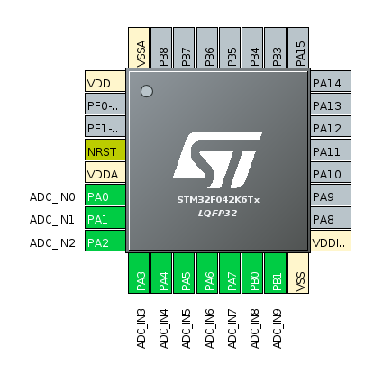

# custom motor controller project

specs:

30V/10A max (due to available power supply)

## parts to spec

- microcontroller & usb interface

STM32F042C4T6 seems pretty good. available: [digikey](https://www.digikey.com/short/z1jqnp) it really is LQFP, ignore the image.

On second thought: STM32F042K6T6, 32LQFP, fewer pins to waste. [dk](https://www.digikey.com/short/z1jj8q)

- gate drivers

STM L6498D: [digikey](https://www.digikey.com/short/z1jq1r)
These are pretty neat. Vcc 10 to 20V; Vinh < 3V3; maximum Vout 480 (600 transient). Not sure how reasonable that is in the package size but it's cool. Would limit Vout to Vcc unless I want multiple supply inputs... linear regulator?

- lin reg

L78M12CV for gate driver 12V supply. [digikey](https://www.digikey.com/short/z1j83q)

LF33ABV-DG for uC, powered off 12V bus. Brilliant. [digikey](https://www.digikey.com/short/z1j83n)

- FETs

STP16NF06L they are for motor control, datasheet says so! [dk](https://www.digikey.com/short/z1j8qm)

- Current sense

AD8418: bidirectional, works at 3v3. fixed gain of 20V/V, meaning rsense controls transimpedance.

### STM32F042 Board Design Notes

- Vdd = Vdda = Vddio2 = Vbat = 3v3, should be ok to consolidate to one rail
- Vdd: 4.7uF + (100nF each)
- Vddio2: 4.7uF + 100nF
- Vdda: 1uF + 10nF, recommended "external filtering" from Vdd. If separate rail, use schottky for sequencing
- Vbat: recommends tying to Vdd if no battery

- NRST appears to have internal pullup
- watch out for BOOT0 pin

serial wire debug (SWD)
- SWDIO on PA13 (default int pullup)
- SWCLK on PA14 (default int pulldown)
- SWD header pinout: 1 = Vddio2, 2 = SWDIO, 3/5/9 = gnd, 4 = SWCLK, 10 = NRST

- Unused clocks/counters should be frozen or disabled. Unused IO should be driven to 0 or set as outputs.

### gate driver notes

- Cvcc: how about 1uF
- Rfilt, Cfilt into inputs: Rfilt << 75k
- Cboot: Cboot >> Qgate/Vgate. Think I'll start with 1uF and workshop it
- Rg: how about 0 to start with

## design questions

- how to spec capacitance & capacitors?

An ideal power supply would not require any bulk capacitance. The bulk capacitance offsets inductive drop at moments of high dI/dt... note that, on average, the capacitors supply zero power.

Suppose I use a small number of, say, 22uF low ESR electrolytics near the current path. That should be plenty.

- how to do automatic precharging?

I can skip for now. Just keep bulk capacitance small, it's ok.

## notes

DRV8306 by TI exists as a standalone 3-phase motor driver. Expects a PWM input from the microcontroller. Basically implements all the logic and calculations internally as a standalone device. Seems to be designed for such applications, but too encapsulated for good learning.

For the next rev: parallel vdd/gnd/A/B/C lines, fets in lines parallel with traces (high side switches near vdd, low sides near gnd). holes in board connect outputs to FETs. basically manhattan routing thick traces. i guess low current traces could stay on bottom... would probably look pretty good. obviously not worth optimizing too much when non-pcb current paths are the high-current inevitability.

## software setup

- downloading stm32cubemx (discrete from stm32cubeide, seems to only contain configuration tools)
- requires JRE: `sudo apt install openjdk-8-jre`
- usb and can are mutually exclusive haah
- PA12 = usb+, PA11 = usb-

## kicad questions

- how to do rooms/reproduce layout?
- adjust trace angle while routing (i.e. spacebar in altium): it's `\` for some reason
- hide airwires met by unfilled pour: fill, then use "do not show filled in areas" (left icon bar)
- switch layer hotkey
- multiroute
- keep 45 degree angles when dragging traces

### pcb questions

- stitching around outside why?
